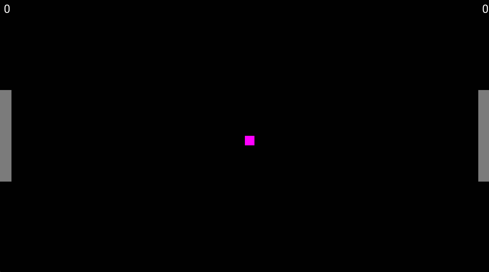

# C++ 2D Game Engine

A lightweight 2D game engine built from scratch in C++ using SDL3, developed as a personal project to deepen my understanding of low-level systems programming, game architecture, and real-time rendering.

## Demo

**Pong** — built entirely using this engine as a proof-of-concept to validate core systems.



---

## Features

- **Rendering** — SDL3-based 2D rendering pipeline with double buffering for smooth frame output
- **Collision Detection** — AABB (Axis-Aligned Bounding Box) collision detection between game objects
- **Input Handling** — Event-driven and state-based keyboard input system for real-time controls
- **Game Loop** — Delta time game loop ensuring frame rate independent movement across all hardware
- **Text Rendering** — SDL3_ttf integration for in-game UI and score display
- **Window Resizing** — All game elements scale dynamically with the window size

---

## Pong Controls

| Action | Player 1 (Left) | Player 2 (Right) |
|---|---|---|
| Move Up | `W` | `Up Arrow` |
| Move Down | `S` | `Down Arrow` |
| Serve | `Space` | `Space` |
| Quit | `Escape` | `Escape` |

First player to 5 points wins. The ball increases in speed with each paddle hit.

---

## Getting Started

### Just want to play?
 
Download the latest release, unzip, and double click `Pong.exe` — no setup required.

[Download Pong (Windows)](https://github.com/lawunder/my-engine/releases/latest)
 
---
 
### Build from Source

#### Prerequisites

- Windows 10 or later
- Install [MSYS2](https://www.msys2.org/), then open the **MSYS2 MinGW64** terminal and run:

```bash
pacman -S mingw-w64-x86_64-gcc mingw-w64-x86_64-cmake mingw-w64-x86_64-ninja mingw-w64-x86_64-sdl3 mingw-w64-x86_64-sdl3-ttf
```

#### Building

1. **Clone the repository**
   ```bash
   git clone https://github.com/lawunder/my-engine.git
   cd my-engine
   ```

2. **Configure and build**
   ```bash
   /c/msys64/mingw64/bin/cmake -B build -G Ninja
   /c/msys64/mingw64/bin/cmake --build build
   ```

3. **Run**
   ```bash
   ./build/Pong.exe
   ```

> **Note:** All required DLLs are included in the repository and copied to the build folder automatically by CMake.

---

## Project Structure

```
my-engine/
├── src/
│   ├── main.cpp      # Entry point and game loop
│   ├── game.cpp      # Engine system implementations
│   └── game.h        # Structs and function declarations
├── assets/
│   └── fonts/        # Font files
├── dlls/             # Required runtime DLL dependencies
└── CMakeLists.txt    # Build configuration
```

---

## Roadmap

- Audio system (SDL3 Mixer)
- Entity Component System (ECS) architecture
- Cross-platform support (Mac/Linux)
- OpenGL rendering backend

---

## Built With

- [C++17](https://en.cppreference.com/w/cpp/17)
- [SDL3](https://www.libsdl.org/)
- [SDL3_ttf](https://wiki.libsdl.org/SDL3_ttf/FrontPage)
- [CMake](https://cmake.org/) + [Ninja](https://ninja-build.org/)
- [MSYS2](https://www.msys2.org/) / MinGW64

---

## Author

**Lucas Wunderlich**
[github.com/lawunder](https://github.com/lawunder) · [linkedin.com/in/lucaswunderlich](https://www.linkedin.com/in/lucaswunderlich)